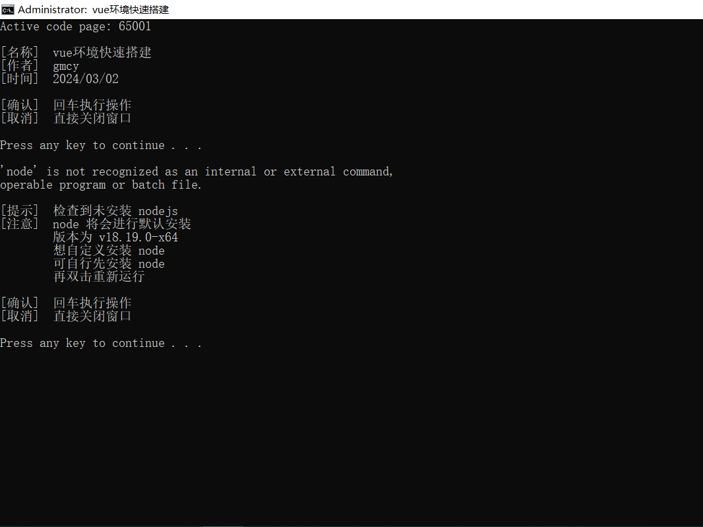
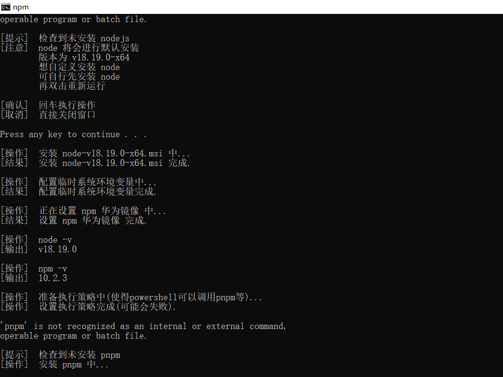
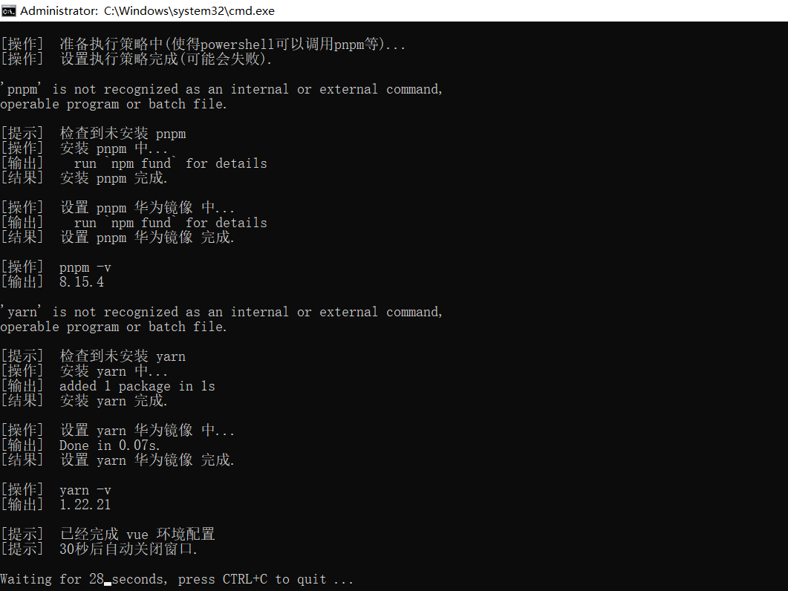

# vue环境快速搭建

## 1. 基本信息

- 作者: GMCY
- 系列: Vue
- 仓库: [GitHub](https://github.com/GMCY2020/Vue-Venv-Fast-Build) | [Gitee](https://gitee.com/GMCY2020/Vue-Venv-Fast-Build)
- 话题(GitHub): [tools](https://github.com/topics/tools) \ [vue](https://github.com/topics/vue)
- 创建时间: 2024/03/02

## 2. 介绍

功能	
- 批处理文件 
- `vue` 环境的快速搭建
- `nodejs`, `npm`, `pnpm`, `yarn` 自动 `下载安装`
- `npm`, `pnpm`, `yarn` 自动 `设置镜像`
- 自动检测是否已安装了相关环境，没有便会自动下载、安装、配置

注意
- `nodejs` [v18.19.0-x64](https://npmmirror.com/mirrors/node/v18.19.0/node-v18.19.0-x64.msi)
- `npm` v10.2.3
- `pnpm` v8.15.4
- `yarn` v1.22.21
- `镜像`  [华为镜像](https://mirrors.huaweicloud.com/repository/npm/)
- 默认安装, 即配置上述版本
- 如果使用本批处理文件, 而造成的后果等, 与本人无关(应该不至于, 插个眼预防一下)...

适用环境
- 适合用于上课频繁更换机房, 且机房会重置的情况下

## 3. 环境

- 目前适配 win10
- win10以下 大部分不适配, 因为 较高版本 nodejs 不适配.

## 4. 使用

- 需联网
- 解压 `vue-venv-fast-build.zip`
  （bat文件上传后再下载部分内容被改变,所有使用压缩包压缩）
- 双击 `vue-venv-fast-build.bat`
- 然后一直回车即可

## 5. 效果图

